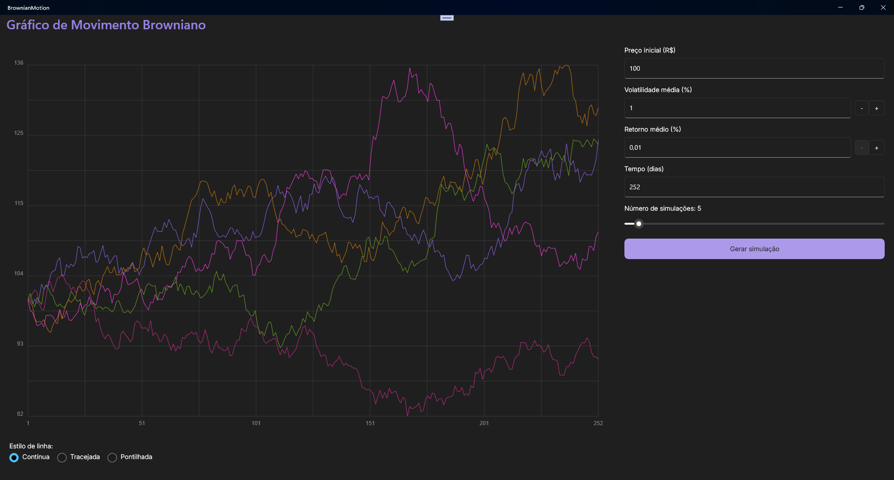
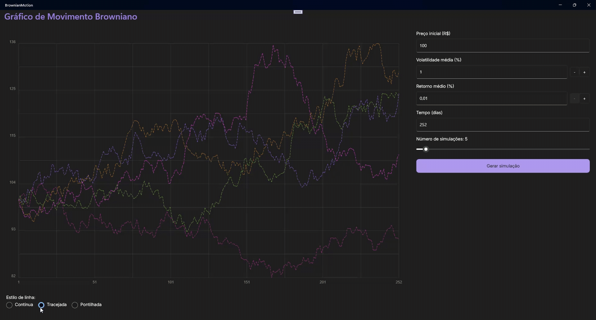

# Brownian Motion

Projeto desenvolvido para simulação de movimento browniano, permitindo visualizar múltiplas simulações de preços ao longo do tempo, com controle de parâmetros como preço inicial, volatilidade e retorno médio.

## Tecnologias Utilizadas

- **.NET MAUI 9** (Windows)
- **CommunityToolkit.Mvvm** para MVVM e comandos
- **Xunit** para testes unitários
- **IDrawable/GraphicsView** para renderização do gráfico

## Funcionalidades

- **Gerar simulação:** Crie múltiplas simulações de preços com base nos parâmetros definidos.
- **Ajuste de parâmetros:** Configure preço inicial, volatilidade, retorno médio, número de dias e número de simulações.
- **Estilo das linhas:** Escolha o estilo da linha do gráfico (contínua, tracejada, pontilhada).
- **Visualização gráfica:** Gráfico com linhas coloridas.
- **Grade e rótulos:** Grade de fundo com linhas discretas e rótulos nos eixos X (dias) e Y (preços).

## Como Rodar o Projeto

1. **Clonar o repositório**
   - Baixe ou clone este repositório usando o GitHub Desktop ou outro gerenciador de Git.

2. **Abrir o projeto no Visual Studio**
   - Abra o **Visual Studio 2022 (ou superior)** com suporte a .NET MAUI.
   - Vá em **Arquivo → Abrir → Projeto/Solução** e selecione o arquivo `.sln`.

3. **Restaurar pacotes NuGet**
   - No **Gerenciador de Soluções**, clique com o botão direito na solução e selecione **Restaurar Pacotes NuGet**.

4. **Selecionar a plataforma de destino**
   - Na barra superior, escolha **Windows Machine** como alvo de execução.

5. **Compilar e executar**
   - Clique em **Iniciar (Play)** ou pressione **F5** para compilar e rodar a aplicação.

## Testes Unitários

Para rodar os testes, clique com o botão direito no projeto **BrownianMotion.Tests** e selecione **Run Tests**.

Os testes cobrem a geração de simulações, garantindo que os valores estejam corretos e dentro das expectativas matemáticas.

## Prints da Aplicação

